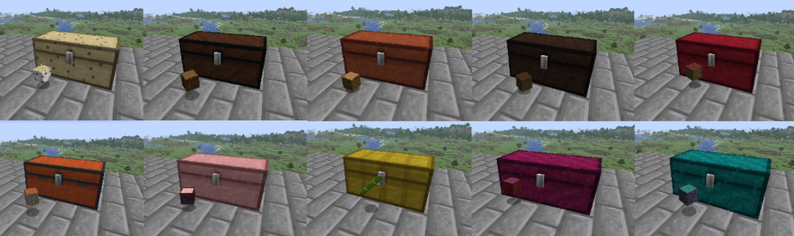
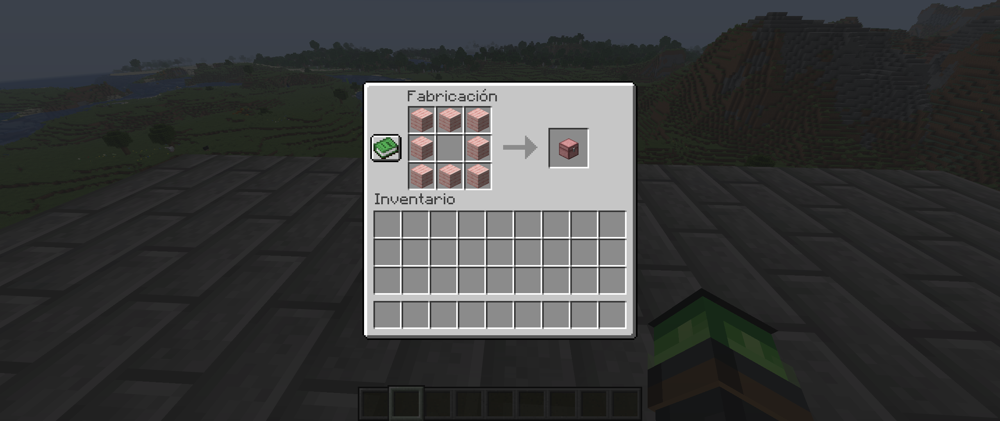
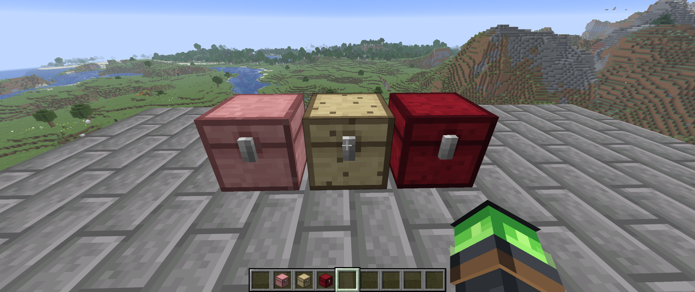

<h1 align="center">🪵 Timber Chests</h1>

<p align="center">
  🌟 Cofres con aspecto vanilla para cada tipo de madera de Minecraft 🌟
</p>

<p align="center">
  <a href="https://github.com/Roger08G/minecraft-timber-chests/actions/workflows/build.yml"></a>
  <a href="https://github.com/Roger08G/minecraft-timber-chests/releases"></a>
  <a href="https://github.com/Roger08G/minecraft-timber-chests/stargazers"></a>
  <a href="https://github.com/Roger08G/minecraft-timber-chests/network/members"></a>
  
  
  
  <a href="LICENSE"></a>
</p>

`Timber Chests` añade cofres inspirados en cada madera de Minecraft, conservando
el inventario, la animación, los sonidos, la interacción con tolvas y
comparadores, y el comportamiento de los cofres dobles.



## Compatibilidad

| Componente | Versión |
| --- | --- |
| Minecraft: Java Edition | 26.2 |
| NeoForge | 26.2.0.88 o posterior de la rama 26.2 |
| Java para jugar/compilar | Java 25 / JDK 25 |
| Mod | 1.0.0 |

Este es un mod para Minecraft Java Edition con NeoForge. **Una instalación sin
loader de mods no puede cargar el archivo JAR.** No sirve para Bedrock Edition.
En multijugador, el cliente y el servidor necesitan el mod.



## Instalación en Windows

1. Instala Minecraft Java Edition 26.2 y NeoForge para 26.2 desde
   [NeoForged](https://neoforged.net/).
2. Copia `TimberChests-1.0.0-mc26.2-NeoForge.jar` a la carpeta `mods` de la
   instalación de NeoForge. El archivo se entrega también en el Desktop.
3. Inicia el perfil de NeoForge desde el lanzador de Minecraft.

El JAR no es un instalador y no se ejecuta con doble clic.

## Contenido

Roble, abeto, abedul, jungla, acacia, roble oscuro, mangle, cerezo, bambú,
carmesí y distorsionado. Ocho tablones iguales crean el cofre correspondiente.
Los tablones mezclados siguen creando el cofre normal. Los tablones de otros
mods también crean el cofre normal, salvo que otro mod aporte una receta propia.

El contenido usa las clases nativas de cofres de Minecraft: 27 espacios por
cofre sencillo y 54 por cofre doble, bloqueo por gato o bloque sólido,
waterlogging, enfado de piglins y conservación del nombre personalizado.



## Compilación y validación

Usa JDK 25 y Python 3.11 o posterior. Ejecuta en PowerShell:

```powershell
.\gradlew.bat build
python -m pip install -r requirements-dev.txt
python tools/validate_project.py --jar build/libs/timber_chests-1.0.0.jar
```

El artefacto de compilación está en `build/libs/timber_chests-1.0.0.jar`.
La validación comprueba los JSON, las 33 texturas existentes y el contenido del JAR.
La CI ejecuta estas comprobaciones y publica el JAR como artefacto de cada
compilación. Dependabot revisa Gradle, GitHub Actions y Python semanalmente.

Para iniciar un cliente de desarrollo:

```powershell
.\gradlew.bat runClient
```

## Texturas

Las 33 texturas PNG de runtime se mantienen sin cambios en esta versión.
El generador original está en `tools/generate_chest_textures.py`; la imagen
conceptual de `docs/` no se incluye en el juego.

## Licencia

La licencia del proyecto está en [LICENSE](LICENSE).
