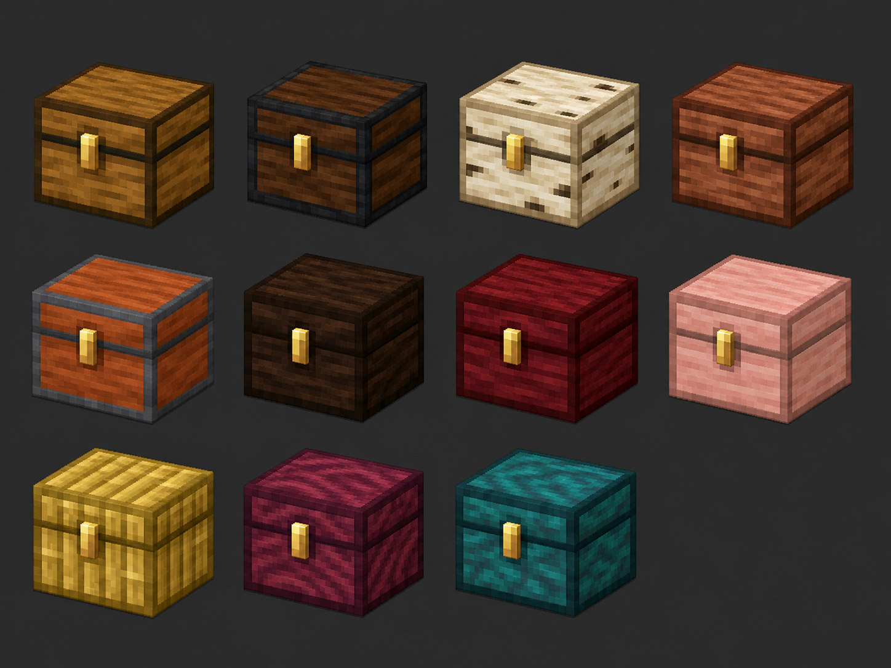

# Timber Chests

Vanilla-style chest variants for every Minecraft wood type.



## Compatibility

- Minecraft Java Edition **1.21**
- NeoForge **21.0.167 or newer in the 21.0 line**
- Java **21**
- Mod version **0.1.0**

This build intentionally targets Minecraft 1.21 exactly. It is not marked as
compatible with 1.21.1 or later game versions.

## Included chests

Oak, spruce, birch, jungle, acacia, dark oak, mangrove, cherry, bamboo,
crimson, and warped.

Eight matching vanilla planks craft the corresponding chest. Mixed planks
still craft the normal vanilla chest. A homogeneous set of planks added by
another mod also falls back to the vanilla chest unless that mod adds its own
specific recipe.

## Vanilla behavior preserved

Every variant delegates its behavior to Minecraft's `ChestBlock` and
`ChestBlockEntity` implementations:

- 27 inventory slots (54 for a valid double chest)
- vanilla opening animation and sounds
- hopper and comparator support
- cat and solid-block obstruction checks
- vanilla hardness, blast resistance, and tool behavior
- custom-name preservation when broken
- piglin anger behavior
- waterlogging

Only two adjacent chests backed by the same registered block can join. Two
different wood variants remain independent.

## Build

On Windows PowerShell, point `JAVA_HOME` to a JDK 21 installation and run:

```powershell
.\gradlew.bat build
```

The distributable JAR is written to `build/libs/timber_chests-0.1.0.jar`.

Validate every JSON file, all 33 UV textures, and the packaged JAR with:

```powershell
python tools/validate_project.py --jar build/libs/timber_chests-0.1.0.jar
```

For a development client:

```powershell
.\gradlew.bat runClient
```

## Texture workflow

The runtime textures are deterministic 64×64 chest UV maps generated by:

```powershell
python tools/generate_chest_textures.py --minecraft-resources-jar <path-to-1.21-client-resources.jar>
```

The generator preserves the vanilla latch pixels and adds a distinct palette
and wood treatment for every variant. The generated concept sheet is visual
direction only; it is not loaded at runtime.

## Project layout

```text
src/main/java/dev/timberchests/
├── TimberChests.java
├── block/
├── client/
├── recipe/
└── registry/

src/main/resources/
├── assets/timber_chests/
└── data/
```
